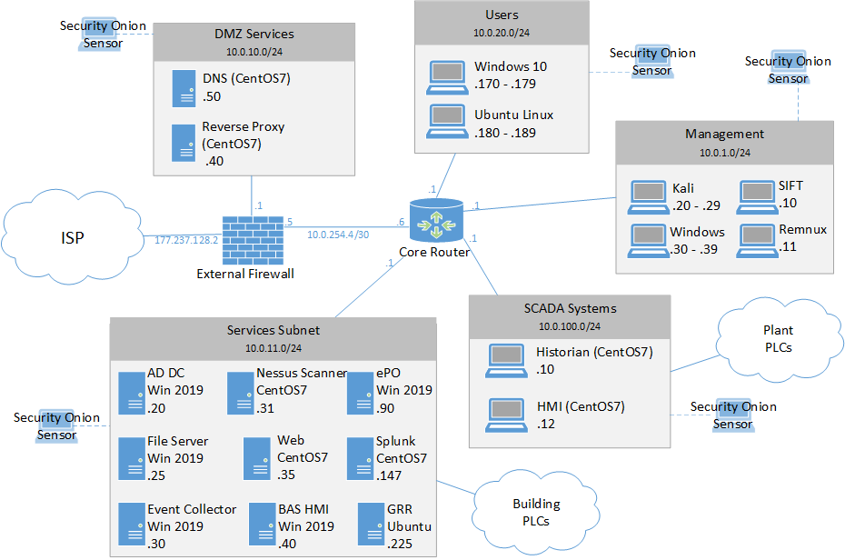

# Example Files

- [Scripts](#scripts)
  - [Random network generation](#random-network-generation)
- [Sample Topology files](#sample-topology-files)
  - [Network 1](#sample-network-1)

## Scripts

### Random network generation

Provides an example of building a random network, given some user provided parameters, queries the filesystem for the generated assets, then updates those assets.

[random_network.py](scripts/random_network.py)

## Sample Topology Files

### Sample Network 1

A small-medium network with SCADA assets and a large number of security devices.

[View JSON File](test_files/sample_net_1.json)

