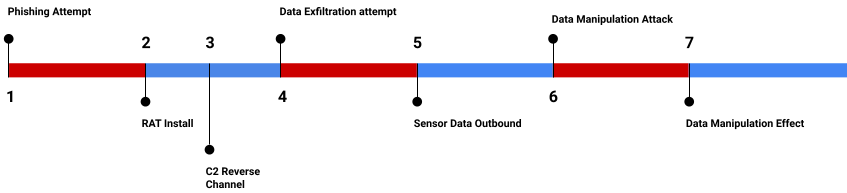

#  Simple Static Attack Example

The static attack is a basic example of some functions in Cyber DEM Python. It uses two separate scripts to mimic two separate simulations: one attacker and one defender.

In this example, the attacker has a pre-scripted attack to (1) phish the administrator of an HMI (SCADA component) with malware which will call back to the attacker's command and control (C2) channel. The C2 channel is then used to (4) exfiltrate data from the sensor readings on the network. Lastly, (6) the attacker loads new malware onto the HMI via the C2 channel to manipulate the SCADA controllers while showing normal data on the HMI. 

On the defender's side, (2) the SCADA admin installs the "update" from the phishing attack on the HMI. The malware then (3) opens up a reverse C2 channel back to the attacker. When the HMI receives (4) the C2 commands to exfiltrate the sensor logs, (5) it sends one week's worth of sensor data. The attacker is able to successfully (7) manipulate incoming sensor data by installing new malware over the C2 channel. 




## Simulation messages

When a simulation successfully receives data but doesn't have a  Cyber DEM artifact to return, it still sends a string formatted "RECEIVED" message to the other simulation to acknowledge receipt.

## Action list

1. **Phishing attempt** (attacker): Threat actor sends phishing email to SCADA admin with "updates for the HMI software".<br>
    CyberEvent --> CyberAction --> CyberAttack --> PhishingAttack
    ```
    PhishingAttack: {
        "id": "86c75da8-8087-4216-9838-c60c36e61ac2",
        "message_type": "Email",
        "body": "Dear Administrator, Please install the attached critical update on your HMI.",
        "targets": ["74e5e909-765f-4542-b207-b4f0e6e09251"]
    }
    ```
    <br>

2. **Remote Access Trojan (RAT) install** (defender): Install "updates" from attacker (RAT) on HMI.<br>
    CyberObject --> Data
    ```
    "Data": {
        "data_type": "Code",
        "name": "HMI Update",
        "description": "HMI vendor update"
    }
    ```
    <br>

3. **C2 reverse channel opens and listens for commands** (defender): Malware on HMI opens reverse channel outbound.<br>
    CyberObject --> Data
    ```
    "Data": {
        "name": "Reverse channel",
        "description": "Representing data packets beaconing from malware"
    }
    ```
    <br>

4. **Data Exfiltration Attempt** (attacker): Attacker uses C2 channel to pull data off of the HMI.<br>
    CyberEvent --> CyberAction --> CyberAttack --> DataExfiltration
    ```
    "DataExfiltration": {
        "id": "e84ca7b3-e599-4346-9a12-f84dc1d2105f",
        "targets": ["b0ee2f75-0b7e-44f6-a27d-2374700989e6"]
    }
    ```
    <br>

5. **Sensor Data Exfiltrated** (defender): Data from  sensors exfiltrated outbound from HMI.<br>
    CyberObject --> Data
    ```
    "Data": {
        "name": "Sensor data",
        "data_type": "File",
        "description": "One week's worth of sensor data files"
    }
    ```
    <br>

6. **Data manipulation** (attacker): Attacker uses C2 channel to install malware designed to show normal readings on the HMI while manipulating controllers. <br>
    CyberEvent --> CyberAction --> CyberAttack --> ManipulationAttack
    ```
    "ManipulationAttack": {
        "id": "e86d2d68-0ce7-46b4-b1fa-4baafe286bee",
        "targets": ["b0ee2f75-0b7e-44f6-a27d-2374700989e6"]
    }
    ```
    <br>

7. **Data manipulation** (defender): The data on the HMI is effected by the malware on the system.<br>
    CyberEvent --> CyberEffect --> Manipulate
    ```
    "ManipulationEffect": {
        "description": "HMI no longer reporting correct data from sensors"
    }
    ```